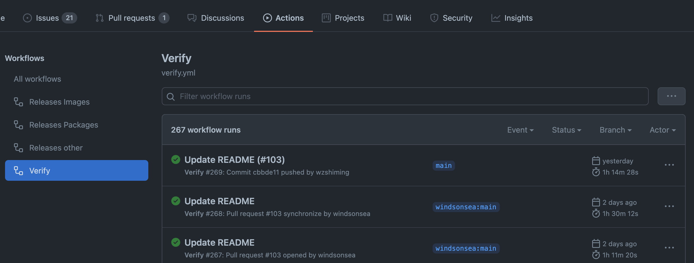
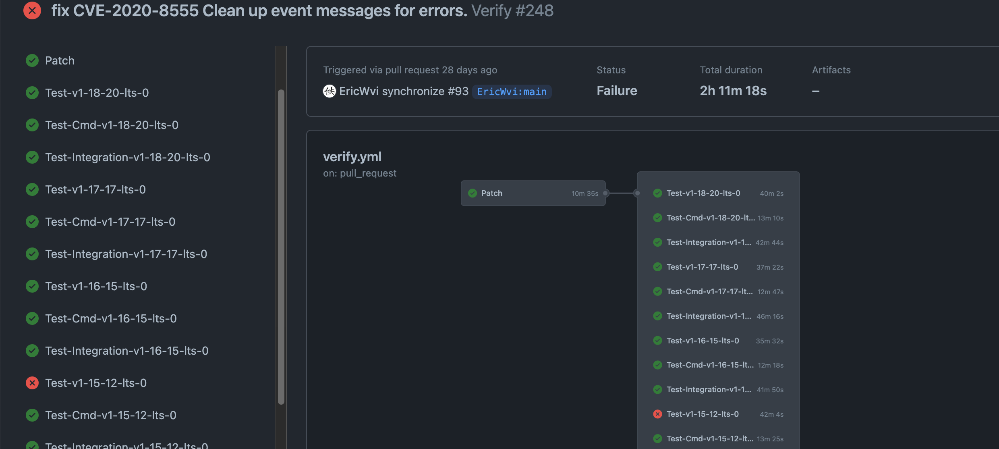
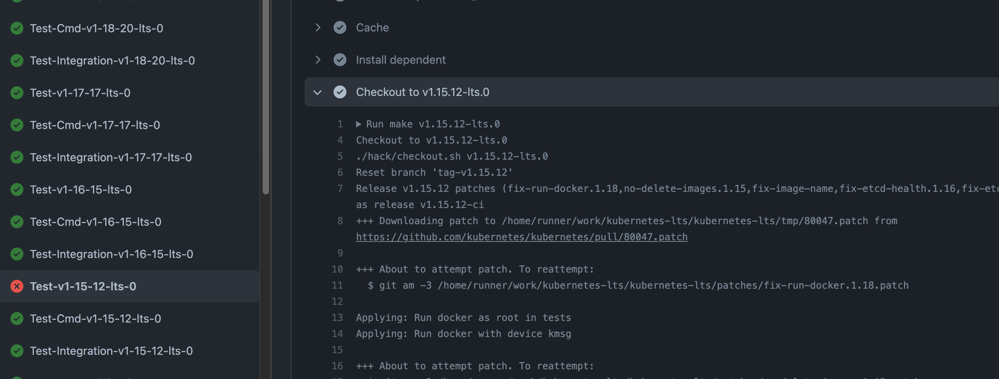

CVE 在 kubernetes 社区是持续更新的，我们需要在维护的所有版本中修复更新的 CVE 漏洞。基于源 patch 文件在低于此 patch 的版本更新出各个版本对应的 patch 文件。`klts` 有自动更新 patch 的功能，我们只需要解决冲突，保证代码的有效性和可用性。

下面将介绍如何把在 `klts` 中添加一个 CVE 补丁。

1. 先指定需要修复的 CVE 脚本，修改 `release.yaml`，先添加对应 CVE 的 `patch` 来源，此路径可以是一个链接，也可以下载到 [/patches](https://github.com/klts-io/kubernetes-lts/tree/main/patches) 目录，`Score` 是代表这个 CVE 的优先级，数值越高说明对安全的影响更大。`< k8s1.13` 表示在1.13（1.12，1.11，1.10）以下的版本都需要被解决漏洞。

在1.12版本中运用 `CVE-2019-11253` patch 文件：

```shell 
     - name: v1.12.10-lts.1
        base_release: v1.12.10-ci
        must: true
        patches:
          - CVE-2019-11253

     # CVSS Score 5.0, < k8s1.13, https://www.cvedetails.com/cve/CVE-2019-11253/
     # TODO
     - name: CVE-2019-11253
       patch:
          - https://github.com/kubernetes/kubernetes/pull/83436.patch
```

2. 检查 `v1.12.10-lts.1` 是否能够完全运用此 patch，如果有冲突，将会手动去解决冲突代码。

```shel
~/workspace/kubernetes-lts: main ± : make v1.12.10-lts.1
Checkout to v1.12.10-lts.1
./hack/checkout.sh v1.12.10-lts.1
remote: Enumerating objects: 77218, done.
remote: Counting objects: 100% (29330/29330), done.
remote: Compressing objects: 100% (11622/11622), done.
remote: Total 14180 (delta 7451), reused 5859 (delta 2116), pack-reused 0
Receiving objects: 100% (14180/14180), 15.77 MiB | 1.90 MiB/s, done.
Resolving deltas: 100% (7451/7451), completed with 4241 local objects.
Reset branch 'tag-v1.12.10'
```

如果输出下面的情况则表示这些文件有冲突：

```shell
To restore the original branch and stop patching, run "git am --abort".

+++ Conflicts detected:

UU Godeps/Godeps.json
UU staging/src/k8s.io/api/Godeps/Godeps.json
UU staging/src/k8s.io/apiextensions-apiserver/Godeps/Godeps.json
UU staging/src/k8s.io/apimachinery/Godeps/Godeps.json
UU staging/src/k8s.io/apiserver/Godeps/Godeps.json
UU staging/src/k8s.io/cli-runtime/Godeps/Godeps.json
UU staging/src/k8s.io/client-go/Godeps/Godeps.json
UU staging/src/k8s.io/csi-api/Godeps/Godeps.json
UU staging/src/k8s.io/kube-aggregator/Godeps/Godeps.json
UU staging/src/k8s.io/metrics/Godeps/Godeps.json
UU staging/src/k8s.io/sample-apiserver/Godeps/Godeps.json
UU staging/src/k8s.io/sample-cli-plugin/Godeps/Godeps.json
UU staging/src/k8s.io/sample-controller/Godeps/Godeps.json
UU vendor/gopkg.in/yaml.v2/decode.go
UU vendor/gopkg.in/yaml.v2/encode.go
Aborting.

+++ Aborting in-progress git am.

+++ Returning you to the tag-v1.12.10 branch and cleaning up.
make: *** [v1.12.10-lts.1] Error 1
```

> 如果出现没法读取到某一个 patch 文件，请确保源 patch 文件正常下载到 `/tmp` 目录，请重新执行 `make` 命令。

3. 根据输出的信息，重新修改 `1.12` 的 patch 信息：

```shell
+++ About to attempt patch. To reattempt:
  $ git am -3 /path/to/kubernetes-lts/tmp/83436.patch

Applying: bump gopkg.in/yaml.v2 v2.2.4
Using index info to reconstruct a base tree...
M	Godeps/Godeps.json
M	staging/src/k8s.io/api/Godeps/Godeps.json
M	staging/src/k8s.io/apiextensions-apiserver/Godeps/Godeps.json
M	staging/src/k8s.io/apimachinery/Godeps/Godeps.json
M	staging/src/k8s.io/apiserver/Godeps/Godeps.json
M	staging/src/k8s.io/cli-runtime/Godeps/Godeps.json
M	staging/src/k8s.io/client-go/Godeps/Godeps.json
A	staging/src/k8s.io/cloud-provider/Godeps/Godeps.json
M	staging/src/k8s.io/csi-api/Godeps/Godeps.json
M	staging/src/k8s.io/kube-aggregator/Godeps/Godeps.json
M	staging/src/k8s.io/metrics/Godeps/Godeps.json
M	staging/src/k8s.io/sample-apiserver/Godeps/Godeps.json
M	staging/src/k8s.io/sample-cli-plugin/Godeps/Godeps.json
M	staging/src/k8s.io/sample-controller/Godeps/Godeps.json
M	vendor/gopkg.in/yaml.v2/decode.go
M	vendor/gopkg.in/yaml.v2/encode.go
M	vendor/gopkg.in/yaml.v2/resolve.go
M	vendor/gopkg.in/yaml.v2/scannerc.go
```

将 patch 复制到[/patches](https://github.com/klts-io/kubernetes-lts/tree/main/patches)目录：

```shell
cp /path/to/kubernetes-lts/tmp/83436.patch patches/CVE-2019-11253.1.12.patch
```

重新修改 `release.yaml` 文件：

```shell
- name: v1.12.10-lts.1
    base_release: v1.12.10-ci
    must: true
    patches:
      - CVE-2019-11253.1.12

# CVSS Score 5.0, < k8s1.13, https://www.cvedetails.com/cve/CVE-2019-11253/
     # TODO
     - name: CVE-2019-11253
       patch:
          - https://github.com/kubernetes/kubernetes/pull/83436.patch
     - name: CVE-2019-11253.1.12
       patch:
          - patches/CVE-2019-11253.1.12.patch
```

3. 手动解决冲突文件，请注意手动解决并不是只是简单的代码替换，要满足下面几个条件：

* 采用 patch 修改的内容

* 上下文没有语法错误

* 必须能通过测试用例

执行下面命令解决冲突文件：

```shell
QUIET=n ./hack/format_patch.sh patches/CVE-2019-11253.1.12.patch

...

+++ Conflicts detected:

UU Godeps/Godeps.json
UU staging/src/k8s.io/api/Godeps/Godeps.json
UU staging/src/k8s.io/apiextensions-apiserver/Godeps/Godeps.json
UU staging/src/k8s.io/apimachinery/Godeps/Godeps.json
UU staging/src/k8s.io/apiserver/Godeps/Godeps.json
UU staging/src/k8s.io/cli-runtime/Godeps/Godeps.json
UU staging/src/k8s.io/client-go/Godeps/Godeps.json
UU staging/src/k8s.io/csi-api/Godeps/Godeps.json
UU staging/src/k8s.io/kube-aggregator/Godeps/Godeps.json
UU staging/src/k8s.io/metrics/Godeps/Godeps.json
UU staging/src/k8s.io/sample-apiserver/Godeps/Godeps.json
UU staging/src/k8s.io/sample-cli-plugin/Godeps/Godeps.json
UU staging/src/k8s.io/sample-controller/Godeps/Godeps.json
UU vendor/gopkg.in/yaml.v2/decode.go
UU vendor/gopkg.in/yaml.v2/encode.go

+++ Please resolve the conflicts in another window (and remember to 'git add / git am --continue')
+++ Proceed (anything but 'y' aborts the patch)? [y/n]
```

终端会暂停在冲突阶段，请注意此时需要`重新打开另一个终端`去解决冲突文件，待手动解决完所有冲突进行检查：

```shell
~/path/to/kubernetes-lts/src/github.com/kubernetes/kubernetes:: tag-v1.12.10 ±✚ >R> : git add .
 ~/path/to/kubernetes-lts/src/github.com/kubernetes/kubernetes:: tag-v1.12.10 ✚ >R> : git am --continue
Applying: Limit YAML/JSON decode size
 ~/path/to/kubernetes-lts/src/github.com/kubernetes/kubernetes:: tag-v1.12.10 : git status
On branch tag-v1.12.10
nothing to commit, working tree clean
```

最重要的一步操作就是返回之前的终端，确认冲突已经完成，此时会去更新 `patches/CVE-2019-11253.1.12.patch`。

4. 以上操作就是更新一个版本的 patch 整个操作，可以选择先提交到仓库跑 CI 的测试，如果当前版本的测试用例都通过了就说明此次修复有效。然后选择在此 patch 上向下兼容。修改 `release.yaml` 文件:

```shell
- name: v1.12.10-lts.1
    base_release: v1.12.10-ci
    must: true
    patches:
      - CVE-2019-11253.1.12

- name: v1.11.10-lts.1
    base_release: v1.11.10-ci
    must: true
    patches:
      - CVE-2019-11253.1.11

# CVSS Score 5.0, < k8s1.13, https://www.cvedetails.com/cve/CVE-2019-11253/
     # TODO
     - name: CVE-2019-11253
       patch:
          - https://github.com/kubernetes/kubernetes/pull/83436.patch
     - name: CVE-2019-11253.1.12
       patch:
          - patches/CVE-2019-11253.1.12.patch
     - name: CVE-2019-11253.1.11
       patch:
          - patches/CVE-2019-11253.1.11.patch
```

继续执行 `make v1.11.10-lts.1`，如果有冲突的话，重复以上动作修复。直到验证所最后一个版本（v1.10.13-lts.1）。

5. 当所有的冲突解决完以后，并不意味代码将可以正常使用，必须通过 CI 的测试用例。目前 CI 只支持 `main` 分支。如果在自己的仓库，请在 main 分支进行修改，确保完全无误的情况下再提交 PR 申请合入 [klts](https://github.com/klts-io/kubernetes-lts) 主分支。

在 `github` 查看测试情况：



查看提交的所有 job 信息，下面说明 `1.15.12` 版本测试将不通过：



查看报错信息详情，将错误解决完后重新提交，直到通过所有的测试。

