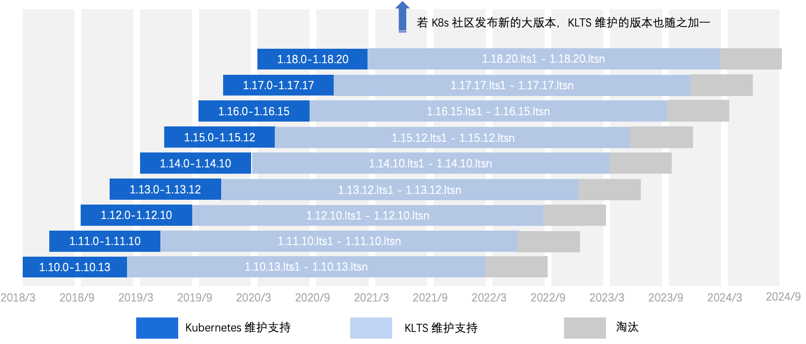

KLTS 全称为 Kubernetes Long Term Support，主要使命是为 Kubernetes 早期版本提供长期免费的维护支持。

之所以需要维护早期版本，是因为在实际生产环境中，最新版本不一定是最好的，也不是最稳定的。如下表所示，Kubernetes 的某个版本在初次发布后一年，才能提供稳定版本。

| **K8s 版本** | **初次发布日期** | **稳定版本日期** |
| :----------- | :--------------- | :------------------- |
| 1.10         | 2018-03-27       | 2019-02-13           |
| 1.11         | 2018-07-28       | 2019-05-01           |
| 1.12         | 2018-09-28       | 2019-07-08           |
| 1.13         | 2018-12-04       | 2019-10-15           |
| 1.14         | 2019-03-25       | 2019-12-11           |
| 1.15         | 2019-07-20       | 2020-05-06           |
| 1.16         | 2019-09-18       | 2020-09-02           |
| 1.17         | 2019-12-08       | 2021-01-13           |
| 1.18         | 2020-03-25       | 2021-06-18           |
| 1.19         | 2020-08-26       | 2021-10-28           |
| 1.20         | 2020-12-08       | 2022-02-28           |
| 1.21         | 2021-04-08       | 2022-06-28           |
| 1.22         | 2021-08-04       | 2022-10-28           |

初次发布：指的是 Kubernetes 初次发布的 0 号版本，即 1.10.0、1.11.0 ... 1.22.0 等。

稳定版本：通常是初次发布大约 1 年后的最后一个 bug fix 版本，然后这个版本 End Of Life (EOL)，即社区从此放弃维护。

如下图所示，其中 1.10 - 1.18 是 KLTS 正在维护的版本，而 1.19 - 1.22 是 Kubernetes 社区目前正在维护的版本，具体请参阅[社区版本维护声明](https://kubernetes.io/releases/version-skew-policy/#supported-versions)。

以 1.19 为例，其稳定版本预计在 2021 年 10 月 28 日提供，但 1.19 稳定版本并不能完全兼容 1.10 到 1.18 的诸多功能，中间有无数次的版本迭代开发，如果企业贸然升级到 1.19，很可能会引发生产事故。而其他 1.20 - 1.22 等新版本也有类似的问题。

现在大多数企业的选择是沿用早期版本，不会贸然升级。但 Kubernetes 社区只维护最新的 4 个版本，如何才能保证早期版本免受社区不定时发现的 CVE 漏洞和 bug 的袭扰呢？这就是 KLTS 的价值所在！我们对早期版本提供长达 3 年的免费维护支持。  

## KLTS 维护周期 {#maint-cycle}
KLTS 目前维护了 9 个稳定版本：1.10.13, 1.11.10, 1.12.10. 1.13.12, 1.14.10, 1.15.12, 1.16.15, 1.17.17, 1.18.20。

如果 Kubernetes 社区发现可能影响生产的 CVE 新漏洞或 bug，KLTS 团队将接手社区放弃维护的这些版本，使其处于持续维护状态。目前这 9 个版本的维护周期如下：

从上图可看出，Kubernetes 社区对某个版本的维护周期通常在一年左右，而 KLTS 可以在接下来的三年内提供长期维护，直至代码无法兼容，才会将相应版本淘汰。
## 漏洞修复 {#bug-fix}
以 2021 年 1 月发现的 [CVE-2021-3121](https://www.cvedetails.com/cve/CVE-2021-3121) 安全漏洞为例，CVSS 危急分数高达 7.5。但截止 2021 年 9 月 Kubernetes 社区：

- 仅修复了 4 个版本：1.18、1.19、1.20、1.21
- 宣称“所有早期版本均有这个安全漏洞，建议用户立即停止使用早期版本”
- 拒绝[修复早期版本漏洞的要求](https://github.com/kubernetes/kubernetes/issues/101435)

 KLTS 针对这一现状，默默修复了深受 [CVE-2021-3121](https://www.cvedetails.com/cve/CVE-2021-3121) 安全漏洞影响的 8 个早期版本：

- v1.17.17
- v1.16.15
- v1.15.12
- v1.14.10
- v1.13.12
- v1.12.10
- v1.11.10
- v1.10.13

 如果您觉得 KLTS 团队的付出有价值，让您值得信赖，欢迎任何开发者加入 [KLTS 社区](https://github.com/klts-io)交流并做出贡献。
## 版本说明 {#klts-ver}
KLTS 提供的 Kubernetes 常见版本号如下：   

其中 V1.16.15 是 Kubernetes 的完整发行版本号，1.16 是大版本号，15 是社区补丁版本，而 lts.0 是 KLTS 提供的补丁版本号。 
